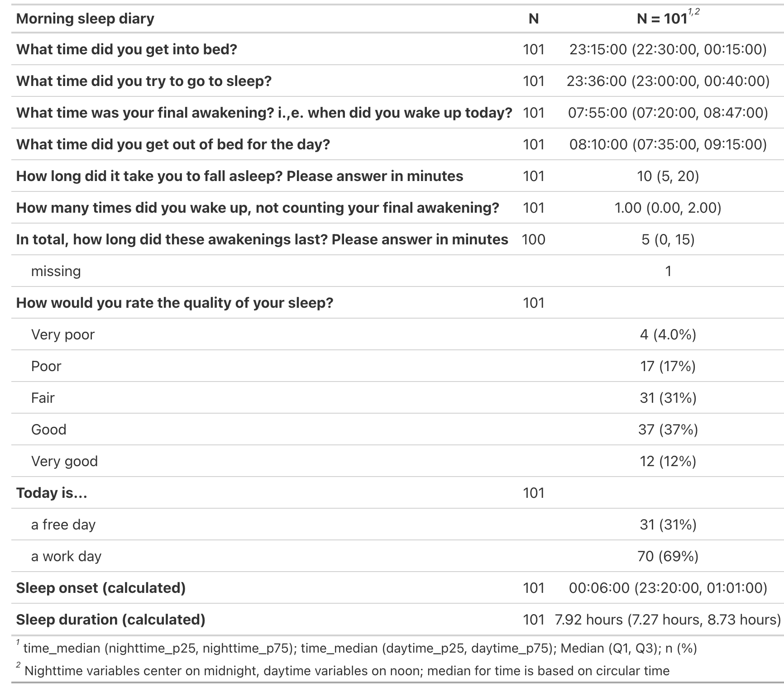

<!-- README.md is generated from README.Rmd. Please edit that file -->

```{r, include = FALSE}
knitr::opts_chunk$set(
  collapse = TRUE,
  comment = "#>"
)
```

   
   


### Personal light exposure dataset for Delft, The Netherlands; collected by The Hague University of Applied Sciences (THUAS) following the protocol of Guidolin et al. 2024 (MeLiDos field study)

**Version v1.0.0**

<!-- badges: start -->
[](https://doi.org/10.5281/zenodo.17979893)
<!-- badges: end -->


### About this repository

This repository contains the comprehensive dataset for the [MeLiDos](www.melidos.eu) field study site of Delft, The Netherlands. Data were collected by [The Hague University of Applied Sciences (THUAS)](https://www.thuas.com) and are further processed and analysed by the [Translational Sensory & Circadian Neuroscience Unit (TSCN)](https://www.tscnlab.org). A detailed description of the experiment is available in [Guidolin et al., 2024](https://www.ncbi.nlm.nih.gov/pubmed/39592960).

This repository is transitioning towards a [FAIR](https://www.go-fair.org/fair-principles/) and fully human and machine-readable light exposure dataset, based on a [community-based and peer-reviewed Metadata descriptor](https://bmcdigitalhealth.biomedcentral.com/articles/10.1186/s44247-024-00113-9). As part of this transition, files will be converted from semi-rectangular data, to fully [tabular data](https://specs.frictionlessdata.io/tabular-data-package/). Further, metadata will be added and converted from XLSX to JSON. For full traceability, all versions will be archived in [Zenodo](https://zenodo.org) and are accessible through their own persistent identifier (DOI).

### Citation

APA reference:

> Didikoglu, A., Akgun, S. G., Aydin, S. N., Kayar, Z., Zauner, J., & Spitschan, M. (2025). Personal light exposure dataset for Delft, The Netherlands (Version 1.0.0) [Data set]. URL: https://github.com/MeLiDosProject/AertsEtAl_Dataset_2025. DOI: 10.5281/zenodo.17979893

## Summary of the dataset
| Dataset name | THUAS |
| --- | --- |
| Period of data collection (total) | February 2025 to October 2025 |
| Location | Delft, The Netherlands |
| Number of participants enrolled  | N=20 |
| Number of participants included in data analysis and this repository | N=15 |
| Duration of experiment for each participant | N=7 days (Monday to Monday) |

### Included files

The following files are included with this Dataset:

- `data/Metadata_MeLiDos_THUAS.xlsx`: Preliminary Metadata prior to conversion to JSON

- `data/Study_dates_MeLiDos_THUAS.xlsx`: Recruitment dates to clean light exposure recordings

- `data`: Folder with measurement and project data in the following structure:
```
    data/
        corrections/
            change_log.xlsx
            THUAS_S020_sleepdiary_20251106.csv
        raw/
            group/
               demographics/
               discharge/
               screening/
            individual/
               $ParticipantID/
                     chronotype/
                     continuous/
                         actlumus_wrist/
                         actlumus_head/
                         actlumus_chest/
                         currentconditions/
                         exercisediary/
                         experiencelog/
                         mHLEA_digital/
                         mHLEA_paper/
                         sleepdiary/
                         wearlog/
                         wellbeingdiary/
```

- `LICENSE`: Licensing terms. This dataset is published with a
  permissive CC-BY-4.0 license

All data are anonymous.

# Descriptive statistics

## Light


## Sleep



# Folder structure
## Group

This folder contains grouped data, i.e. any data that are collected at the group level and/or were grouped to facilitate import during analyses.

| Folder name | Content |
| --- | --- |
| **demographics** | One csv file (`THUAS_S001_S020_demographics_all_20251029.csv`) with demographic information for 20 recruited participants (THUAS_S001–THUAS_S020). |
| **discharge** | Six csv files aggregating discharge-day questionnaires for the 20 recruited participants: discharge summary, LEBA, VLSQ8, ASE, mTFA, and feedback. |
| **screening** | One csv file (`THUAS_S001_S020_health_all_20251029.csv`) containing screening and health information for the 20 recruited participants. |

## Individual
This folder contains individual-level data for N=15 participants, each stored in a separate folder named after the participant ID (THUAS_S001–THUAS_S020 excluding S004, S008, S009, S012, and S013). The data within each participant folder follows the following structure (availability of sensor files may differ by participant).

| Folder name | Content |
| --- | -- |
| **continuous/actlumus_chest** | txt files from ActLumus worn at chest level, plus a device report (`_Report`) when available. |
| **continuous/actlumus_head** | txt files from ActLumus worn at eye level, plus a device report (`_Report`) when available. |
| **continuous/actlumus_wrist** | txt files from ActLumus worn at the wrist, plus a device report (`_Report`) when available. Present for most participants; absent where the device was not worn. |
| **continuous/currentconditions/** | Questionnaire comprising 3 questionnaires on 1) current mood (MoodZoom), 2) light conditions (custom) and 3) alertness (Karolinska Sleepiness Scale). Completed four times per day, at 11:00, 14:00, 17:00 and 20:00. Participants instructed to complete as close as possible to the indicated times, with occasional extra entries upon waking or before bed. |
| **continuous/exercisediary/** | Custom made questionnaire on exercise. Completed daily in the evening. |
| **continuous/experiencelog/** | Custom made questionnaire about experiences wearing the light glasses. Completed any time participant had an experience to report (no restrictions). |
| **continuous/mHLEA_digital/** | Custom made questionnaire completed daily in the evening. |
| **continuous/mHLEA_paper/** | Custom made paper-based questionnaire completed daily in the evening; transcribed to xlsx files by the experimenter after study end.  |
| **continuous/sleepdiary/** | Daily in the morning.  |
| **continuous/wearlog/** | Any time participant had removed or started wearing the light logger. |
| **continuous/wellbeingdiary/** | Daily in the evening. |
| **chronotype/** | Munich Chronotype Questionnaire (MCTQ) & Morning Eveningness Questionnaire (MEQ) completed at study intake (Monday, day 1). |
